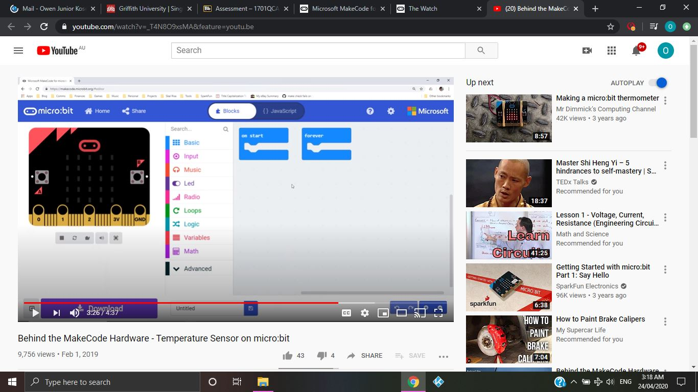
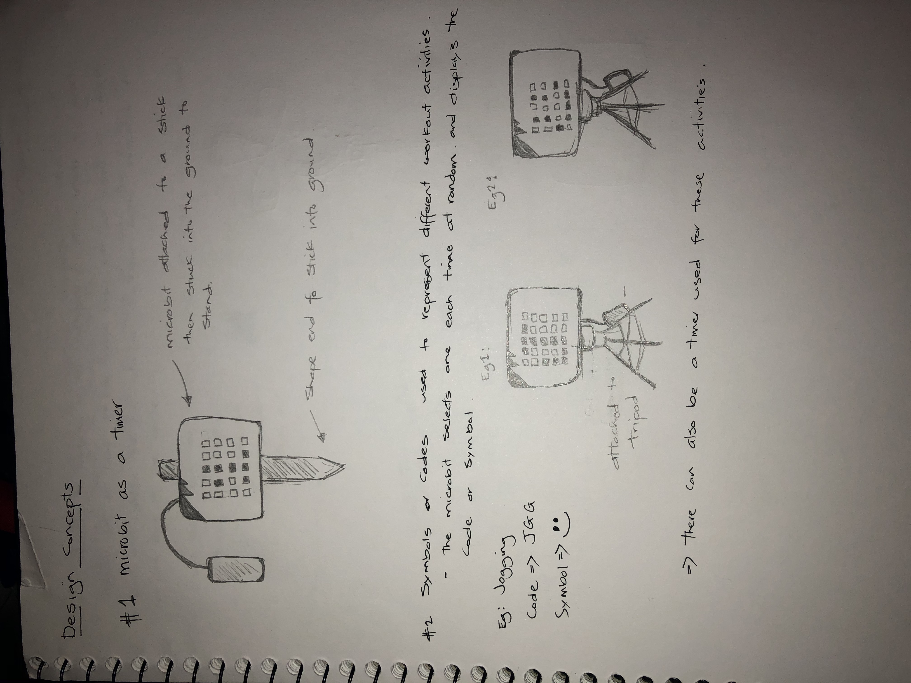
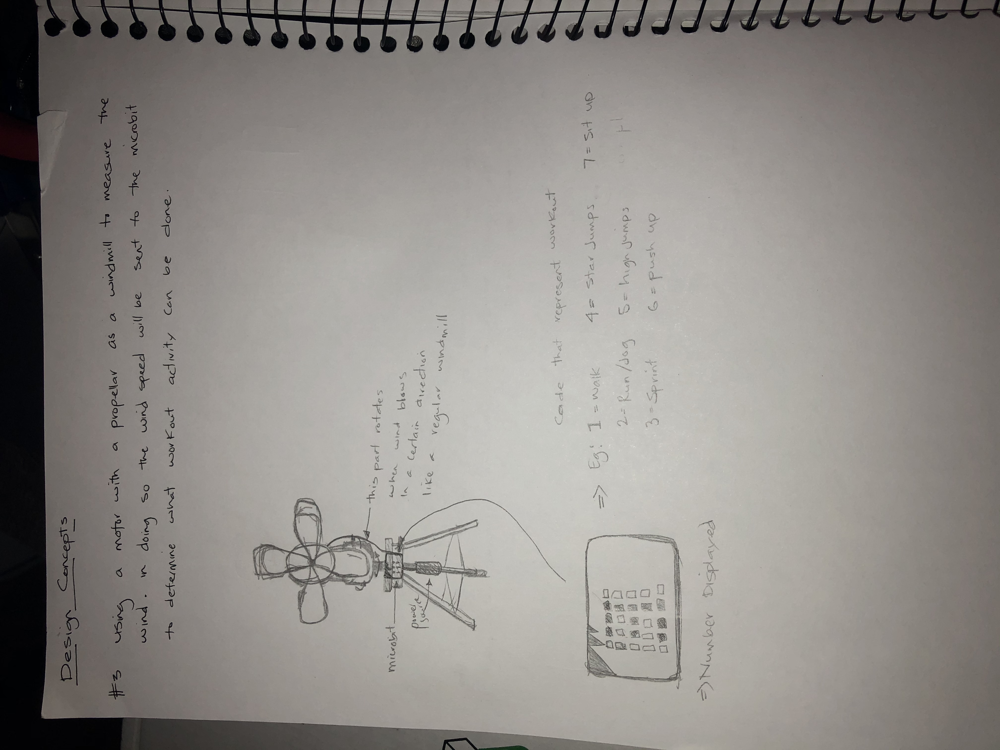
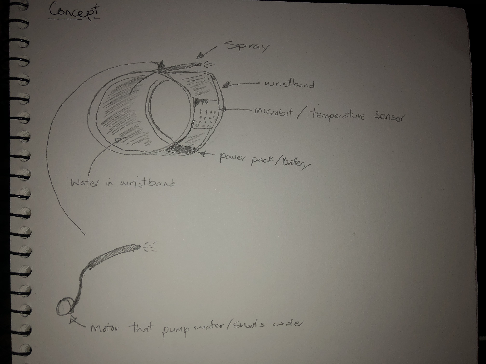
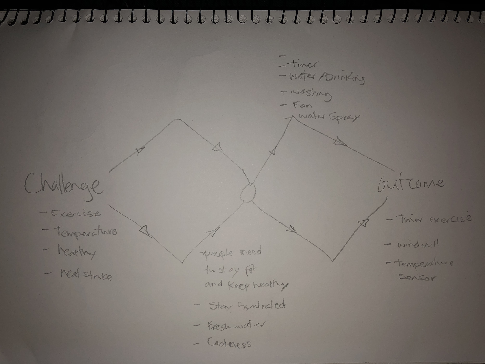

# 1701QCA Making Interaction - Assessment 2 workbook

You will use this workbook to keep track of your progress through the course and also as a process journal to document the making of your projects. The comments in italics throughout the template give suggestions about what to include. Feel free to delete those instructions when you have completed the sections.

When you have completed the template, submit the link to the GitHub Pages site for this repository as a link in Learning@Griffith. The link should be something like [https://qcainteractivemedia.github.io/1701QCA-Assessment2/](https://qcainteractivemedia.github.io/1701QCA-Assessment2/) where `qcainteractivemedia` is replaced with your GitHub username and `1701QCA-Assessment2` is replaced with whatever you called the repository this template is contained in when you set it up.

## Project working title ##
*Exercise Temperature*

## Related projects ##
*Find about 6 related projects to the project you choose. A project might be related through  function, technology, materials, fabrication, concept, or code. Don't forget to place an image of the related project in the appropriate folder and insert the filename in the appropriate places below. Copy the markdown block of code below for each project you are showing.*

### Related project 1 ###
*Temperature sensor*

*https://www.youtube.com/watch?v=_T4N8O9xsMA&feature=youtu.be*

This project is related to mine because *I am also trying to create a temperature sensor with the microbit but with this it will also display the temperature and the difficulty level of workout*.

## Other research ##
*When the temperature is high we humans are vunerable to getting heatstrokes, feeling dizzy, headaches or even fainting. Water is one of the most effective thing that we can use to overcome this as it hydrates the body.*

### *Brief resource name/description* ###

*Provide a link, reference, or whatever is required for somebody else to find the resource. Then provide a few comments about what you have drawn from the resource.*

## Conceptual progress ##

### Design intent ###
*A device that helps with exercising, keeping fit and healthy*

### Design concept 1 ###
*First concept was to use the microbit to create a timer that times your exercise and it also displays codes/numbers that represent a workout activity.* 

*Put the first two design concepts in the sections "Design concept 1" and "Design concept 2". Then put the third, with more development in the section "Final design concept".*

### Design concept 2 ###
*Using a motor with a propeller as a windmill, it can measure the windspeed. In doing so the microbit and determine a workout routine with the windspeed reading from the windmill.*

### Final design concept ###
*My final concept is to create a wristband that has a temperature sensor and whenever its hot it beeps to alert you then shoots out water like a mini water gun to drink or spray your face. Numbers will be used to display the temperature and LED lights on the microbit will display a straign line for it to shoot or lights are spaced out to show it spraying, so that there are two options to choose from.*

### Interaction flowchart ###
*Draw a draft flowchart of what you anticipate the interaction process in your project to be. Make sure you think about all the stages of interaction step-by-step. Also make sure that you consider actions a user might take that aren't what you intend in an ideal use case. Insert an image of it below. It might just be a photo of a hand-drawn sketch, not a carefully drawn digital diagram. It just needs to be legible.*

## Physical experimentation documentation ##

*I have watch some videos on coding a microbit for a temperature sensor. I have started coding, however it is difficult.*

*Materials:
Microbit, plastic tube/pipe, fabric, tape, battery, wire, water carrier/plastic bag, water, motor/pump.*

## Design process discussion ##

*There were ideas that were brainstormed and from there ideas where development. From words, they were turned into challenges that some people in society face today and there were ideas and ways I came up with to overcome some of these challenges. The challenge that I choose to fix was the problem with high temperatures when people are running or walking around.*

## Next steps ##
*In the next few weeks I will be gathering the necessary equipment to build my project, I will also be trialling some coding on the microbit to see if it functions well.
Further reseach will be conducted to help develop the idea more.
I will iterate on this idea and see if there are other better concepts for it and it test out some of these concepts or ideas.
Conduct test with project and design the body of the project to hold equipment.*
